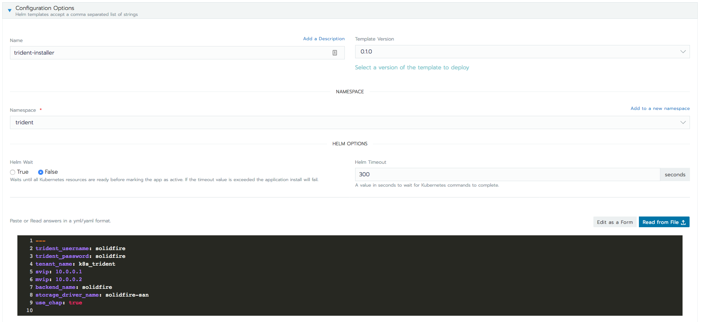
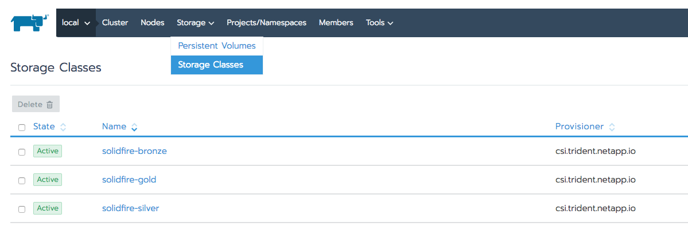

# Installing Trident with Helm

1. Select a cluster / project where Trident will be installed.
2. Click 'Apps'
3. Click 'Launch'
4. Select `trident-installer` from the `trident` Catalog
5. Configure the deployment
    * Set `namespace` to `trident` (IMPORTANT!)
    * Customize the chart values for your environment:

6. Click `Launch` to launch the chart.
7. In a few minutes, Trident will be running, and new Storage Classes will be available on the cluster:

