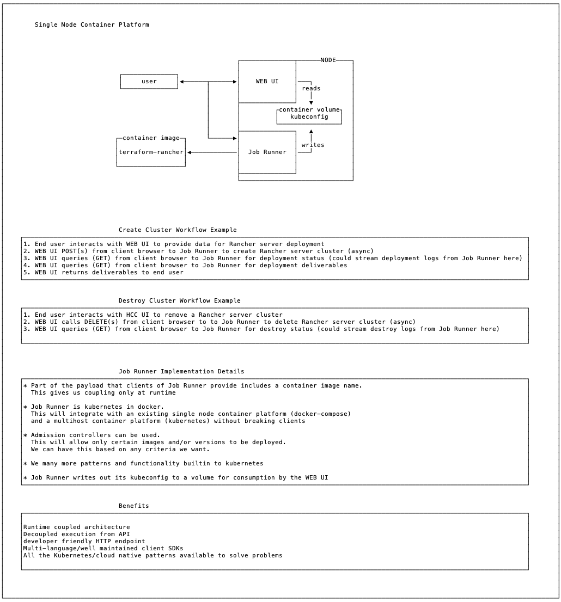

# Architecture Diagram



# Working Proof of Concept

## Server Side
###### High level steps to integrate on a node - build time integration

```bash
# one option is to create a systemd service with the first line below
kind create cluster --config kind-config.yaml
kind load docker-image ez-rancher # this line is for use with this guide
```

## Client Side
###### High level steps of an example client interaction - HCC UI would do all the same in Angular, for example. The example below is using the bash client (`kubectl`)  

create pvc to save deliverables to  
`metadata.name` must be unique
```bash
kubectl apply -f pvc.yaml
```

create configmap with tfvars file. be sure to update the configmap.yaml with your info!  
`metadata.name` must be unique
```bash
kubectl apply -f configmap.yaml
```

create rancher cluster  
`metadata.name` and `spec.template.metadata.name` must be unique  
`spec.template.volumes[0].configMap.name` must match the configmap `metadata.name`  
`spec.template.volumes[0].persistentVolumeClaim.claimName` must match the pvc `metadata.name`
```bash
kubectl apply -f job-apply.yaml
```
watch apply job logs
```bash
kubectl logs -f $(kubectl get pods -l job-name=apply-rancher --output=jsonpath={.items..metadata.name}) apply-rancher
```

identify when rancher has completed
```bash
PODNAME=$(kubectl get pods -l job-name=apply-rancher --output=jsonpath={.items..metadata.name})
until kubectl get pod ${PODNAME} --output=jsonpath='{.status.containerStatuses[?(@.name=="apply-rancher")].state.terminated}' | grep -q "Completed"; do echo -n "."; sleep 2; done
```

retrieving deliverables
```bash
# after the create job is complete
PODNAME=$(kubectl get pods -l job-name=apply-rancher --output=jsonpath={.items..metadata.name})
kubectl cp -c deliverables default/${PODNAME}:/deliverables ./deliverables
```

signal job to end. this allows the deliverables container to stay running so a client can retrieve deliverables, etc. timeout is 1 hour and job will clean itself up
```bash
touch done
PODNAME=$(kubectl get pods -l job-name=apply-rancher --output=jsonpath={.items..metadata.name})
kubectl cp -c deliverables done default/${PODNAME}:/deliverables/done
rm done
```

remove rancher cluster  
`metadata.name` and `spec.template.metadata.name` must be unique  
`spec.template.volumes[0].configMap.name` must match the configmap `metadata.name`  
`spec.template.volumes[0].persistentVolumeClaim.claimName` must match the pvc `metadata.name`  
```bash
kubectl apply -f job-destroy.yaml

# wait for remove to complete then clean up configmap and pv
kubectl delete -f configmap.yaml
kubectl delete -f pvc.yaml
```

watch destroy job logs
```bash
kubectl logs -f $(kubectl get pods -l job-name=destroy-rancher --output=jsonpath={.items..metadata.name}) destroy-rancher
```

## Troubleshooting
```bash
# show images in kind
docker exec -it kind-control-plane crictl images

# drop into a shell
kubectl exec -it $(kubectl get pods -l job-name=apply-rancher --output=jsonpath={.items..metadata.name}) -c deliverables sh
```
