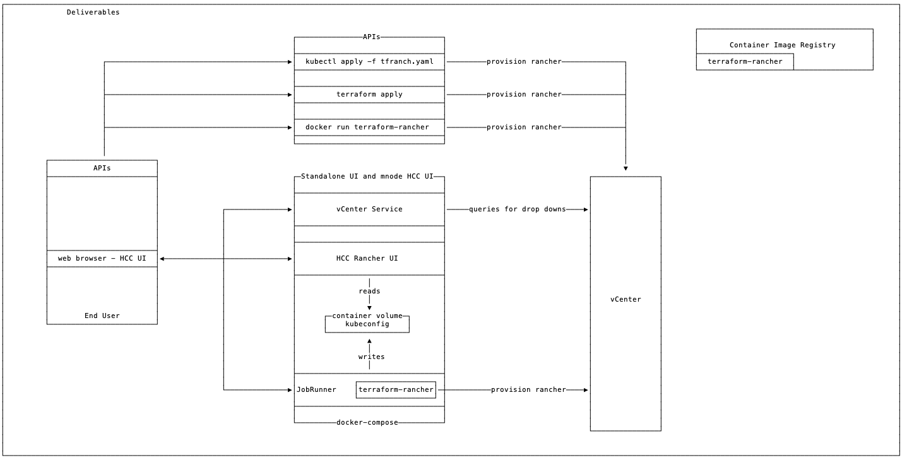

# Drops and Deliverables

Kevin H outlines 3 deliverables during the different drops. My reboot of that diagram is below. This directory contains a starting point for all of these.
1. cli tool - this is the terraform in this repo. [Readme](../../README.md)
2. standalone UI - this is the UI Cole is building plus job-runner (kind cluster). [Readme](./Standalone-UI/README.md)
3. hcc UI - this is the UI Cole is building plus job-runner (kind cluster) running on mnode. [Readme](./HCC-UI/README.md)  

The decoupled architecture diagram [here](../decoupled-arch.png) has been update to reflect a client-side JavaScript implementation.

One Architecture can be delivered for both the Standalone UI and the mnode HCC UI integration.
